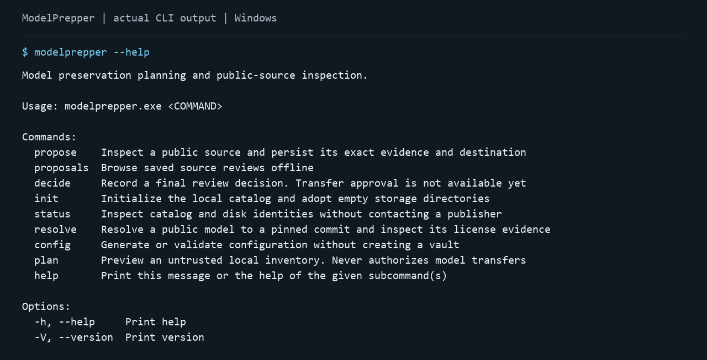
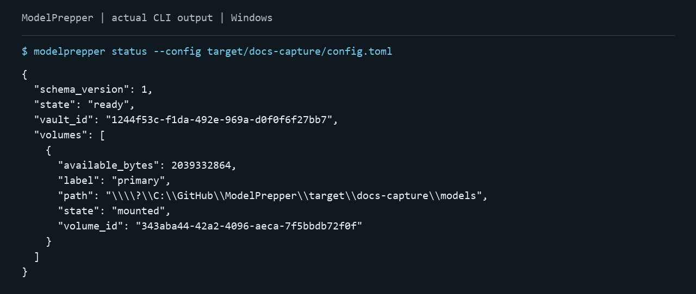

# ModelPrepper

**Keep the models you care about on disks you control.**

ModelPrepper is a native Rust utility being built for personal preservation of open-weight AI models. Its goal is complete, verified copies that remain inspectable when a publisher disappears, a host changes its terms, or access is restricted.

Local custody, portable data, and user control are central. The project rejects censorship and authoritarian concentration of AI access. Read the [project principles](intent.md) and [user experience plan](docs/user-experience.md).

## Project status

**Experimental prototype.** Vault setup, disk identities, offline status, public-source inspection, durable source reviews, and local inventory previews work today. The streaming transfer library is an experiment. Approved downloads, budget accounting, sealed bundles, replicas, and unattended maintenance are still being built. No current CLI command preserves a model end to end.

| Available now | Behavior |
| --- | --- |
| config init/check | Create configuration exclusively and validate its schema and policies. |
| init | Initialize bundled SQLite and adopt empty storage directories with stable disk identities. |
| status | Inspect catalog, disk identities, and actual free space without publisher access. |
| resolve | Pin a public commit and verify license, configuration, tokenizer configuration, and index evidence. |
| propose / proposals / decide | Save exact source reviews, browse offline, and record rejection. Approval remains blocked. |
| plan | Preview untrusted local inventory with selected files, costs, exclusions, and blockers. |

See [implementation status](docs/implementation-status.md) for observed evidence and limitations, and the [roadmap](docs/roadmap.md) for delivery gates.

## Get started

Build from source with the pinned Rust toolchain:

    git clone https://github.com/blisspixel/ModelPrepper.git
    cd ModelPrepper
    cargo build --locked --release

Rust is required to build. The resulting executable needs no Rust, Python, Node, Docker, database installation, inference server, or GPU to run. Platform qualification is tracked in CI and the release plan; production binary releases are not available yet.

PowerShell and shell installers are prepared for verified native releases and offline archives. See [installation](docs/installation.md) for the planned one-command path and release limits.

Create a configuration and initialize an empty vault:

    cargo run --locked --release -- config init --output config.local.toml --catalog catalog --volume models
    cargo run --locked --release -- config check --config config.local.toml
    cargo run --locked --release -- init --config config.local.toml
    cargo run --locked --release -- status --config config.local.toml

Relative storage paths resolve against the config file. Setup refuses unrelated files, overlapping directories, symlinks, and Windows reparse points. Repeating init retains disk identities. A missing or substituted disk is reported without being adopted.

Inspect a public model without downloading weights:

    cargo run --locked --release -- resolve --repo Qwen/Qwen2.5-0.5B-Instruct --revision main

Review the resolved commit and original license evidence. A license tag alone is insufficient. Source inspection always reports transfer_authorized=false.

Try the offline planning fixture:

    cargo run --locked --release -- plan --config examples/config.toml --inventory tests/fixtures/inventory.json --available-bytes 500000000000

The synthetic fixture produces a 5,504-byte preview. Local metadata never authorizes a transfer. See [getting started](docs/getting-started.md) for paths, output, and common problems.

## Current CLI captures

These images render actual output captured from the current release executable. They show the prototype CLI, not a proposed dashboard. Source fingerprints and image checksums are validated by CI; [capture instructions](docs/screenshots.md) explain regeneration.

## Designed for independent custody

- One native implementation with no required hosted ModelPrepper account or telemetry.
- Explicit selection and budgets, with explainable plans and approval boundaries.
- Ordinary self-contained folders and documented manifests.
- Verified resumption, older revision retention, cold storage, reconstruction, and replicas.
- Separate evidence for byte integrity, provenance, and actual offline loading.

These are product requirements. [Current status](docs/implementation-status.md) distinguishes implemented behavior from planned work.

## Documentation

| Start here | Engineering and operation |
| --- | --- |
| [Getting started](docs/getting-started.md) | [Contracts and reason codes](docs/contracts.md) |
| [Native installation](docs/installation.md) | [Durable source reviews](docs/source-reviews.md) |
| [Current status](docs/implementation-status.md) | [Architecture](docs/architecture.md) |
| [Product plan](docs/product.md) | [Storage and recovery](docs/storage.md) |
| [User experience and quality of life](docs/user-experience.md) | [Preservation and offline readiness](docs/preservation.md) |
| [Personal archival policies](docs/archive-policy.md) | [Dependency-aware selection](docs/worries.md) |
| [Roadmap](docs/roadmap.md) | [Native transfer investigation](docs/transfer-spike.md) |
| [Project principles](intent.md) | [Dependencies and platform policy](docs/stack.md) |
| [Responsibilities and limits](docs/notice.md) | [Quality and CI gates](docs/quality.md) |
| [Contributing](CONTRIBUTING.md) | [Repository and release gates](docs/release.md) |

Additional design details: [model sources and mirrors](docs/model-sources.md), [interfaces](docs/interfaces.md), [watch/discovery priorities](docs/worries.md), and [related projects](docs/related-projects.md).

## License and disclaimer

Project code and documentation are [MIT licensed](LICENSE). Preserved models and third-party artifacts retain their own licenses and restrictions.

The software is provided as is, without warranty. The authors and copyright holders disclaim warranties and liability to the extent stated in the MIT license and permitted by applicable law. No guarantee is made about security, data retention, continued source access, model safety, legality, or fitness for a particular purpose.

You are responsible for authorized access, upstream rights, applicable laws, safe execution, and independent backups. A checksum does not establish that a model is safe or runnable. Project philosophy and automated license matching are not legal advice. Read the [full responsibilities and limits](docs/notice.md) before relying on the utility.
